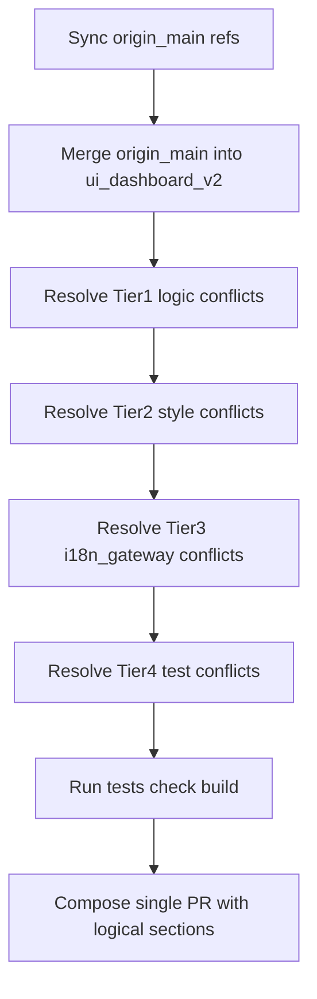

# Merge Main Into Dashboard V2 Cleanly

## Current State (from local analysis)

- Branch `ui/dashboard-v2` is `3` commits ahead of its base and roughly `2162` commits behind local `main`.
- Branch scope is large (`90` files, heavy UI + CSS + tests).
- Highest conflict-risk overlap with `main` is concentrated in:
  - Cron and scheduler UI/controller: [ui/src/ui/views/cron.ts](ui/src/ui/views/cron.ts), [ui/src/ui/controllers/cron.ts](ui/src/ui/controllers/cron.ts), [ui/src/ui/views/cron.test.ts](ui/src/ui/views/cron.test.ts), [ui/src/ui/controllers/cron.test.ts](ui/src/ui/controllers/cron.test.ts)
  - Rendering/state and shared UI types: [ui/src/ui/app-render.ts](ui/src/ui/app-render.ts), [ui/src/ui/app-render.helpers.ts](ui/src/ui/app-render.helpers.ts), [ui/src/ui/app-view-state.ts](ui/src/ui/app-view-state.ts), [ui/src/ui/types.ts](ui/src/ui/types.ts)
  - Global styling: [ui/src/styles/components.css](ui/src/styles/components.css), [ui/src/styles/config.css](ui/src/styles/config.css), [ui/src/styles/base.css](ui/src/styles/base.css)
  - Locales and gateway touchpoint: [ui/src/i18n/locales/en.ts](ui/src/i18n/locales/en.ts), [ui/src/i18n/locales/zh-CN.ts](ui/src/i18n/locales/zh-CN.ts), [src/gateway/server-methods/chat.ts](src/gateway/server-methods/chat.ts)

## Execution Plan

1. **Sync safely before merge**

- Fetch latest remote refs and verify with `origin/main` (not just local `main`).
- Keep existing untracked workspace content untouched (notably `openclaw/`) and avoid broad staging commands.

1. **Merge `origin/main` into branch**

- Run a regular merge into `ui/dashboard-v2` (no rebase), stop on conflicts, and resolve in a fixed order (below).
- Commit exactly one merge commit after all conflicts are resolved and verified.

1. **Resolve conflicts by risk tier**

- **Tier 1 (logic + high churn):** cron/controller/render/state files.
  - Keep API/contract changes from `main` where behavior diverged.
  - Reapply dashboard-v2 UX improvements (new layout/component structure) on top of `main` semantics.
- **Tier 2 (styles):** base/components/config/chat layout styles.
  - Prefer `main` design tokens/variables and re-layer dashboard-v2 visuals to reduce regressions.
- **Tier 3 (i18n + gateway edge):** locale files and gateway chat method.
  - Preserve any new keys/contract updates from `main`; then reintroduce dashboard-v2 strings/behavior.
- **Tier 4 (tests):** update tests only after source is stable.
  - Reconcile deleted/replaced tests and align with final merged behavior.

1. **Validate and stabilize**

- Run targeted UI tests first (cron, config, navigation, chat), then full checks:
  - `pnpm test` (or targeted vitest subsets first)
  - `pnpm check`
  - `pnpm build`
- Fix only merge-induced regressions; avoid opportunistic refactors during conflict resolution.

1. **Prepare one reviewable PR with logical sections**

- Keep a single PR (your preference), but structure the PR description and commit narrative into clear sections:
  - **Dashboard shell + navigation/state**
  - **Chat UX features** (slash commands, pinned/deleted/input history/speech)
  - **Overview panels and login gate**
  - **Cron UX + controller updates**
  - **Visual/theme refresh (CSS/icons/assets)**
  - **Tests and expectation updates**
- This gives reviewer-friendly scope boundaries now and preserves a future path to split follow-up PRs if requested.

## Future Split Opportunities (document-only for now)

If this still feels too large after merge, the cleanest extraction candidates are:

- **PR A: Visual-only refresh**: [ui/src/styles](ui/src/styles), [ui/index.html](ui/index.html), [ui/public](ui/public)
- **PR B: Chat UX capabilities**: [ui/src/ui/chat](ui/src/ui/chat), [ui/src/ui/views/chat.ts](ui/src/ui/views/chat.ts), [ui/src/ui/app-chat.ts](ui/src/ui/app-chat.ts)
- **PR C: Overview/dashboard composition**: [ui/src/ui/views/overview.ts](ui/src/ui/views/overview.ts) plus new overview partials and [ui/src/ui/components/dashboard-header.ts](ui/src/ui/components/dashboard-header.ts)
- **PR D: Cron surface + state handling**: [ui/src/ui/views/cron.ts](ui/src/ui/views/cron.ts), [ui/src/ui/controllers/cron.ts](ui/src/ui/controllers/cron.ts)

